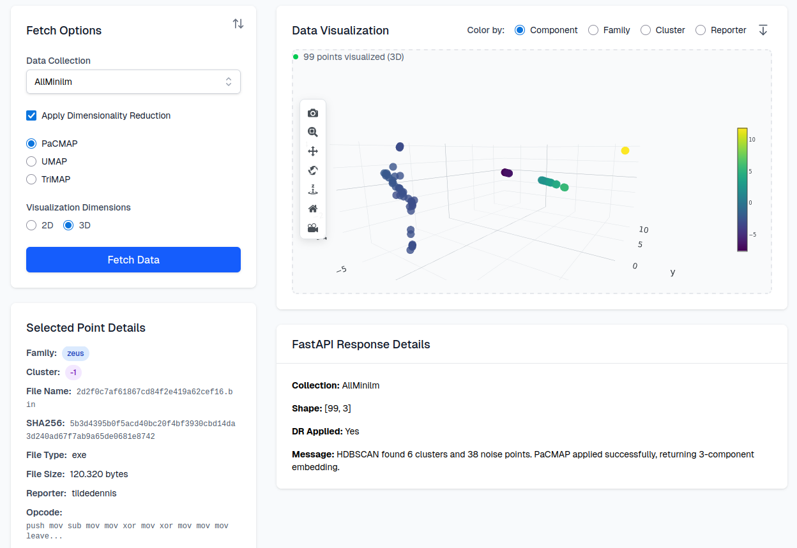

# 📊 Malwareuniverse Visualization

   

An interactive web application for analyzing and visualizing malware embeddings using advanced dimensionality reduction techniques.

## ✨ Features

- **Interactive 3D Visualization**: Explore malware embeddings in 3D space
- **Multiple Dimensionality Reduction**: Support for PaCMAP and other DR methods
- **Color-coded Analysis**: Visualize data by component, family, cluster, or reporter
- **Responsive Design**: Full-width visualization mode with mobile support
- **Point Selection**: Detailed inspection of individual malware samples
- **Real-time Data Fetching**: Dynamic loading from FastAPI backend

## 🎯 Key Components

### VectorVisualization

Interactive 3D plotting component with:
- Zoom and pan controls
- Point selection and highlighting
- Multiple color schemes
- Responsive layout

### FetchControls

Configuration panel for:
- Collection selection
- Dimensionality reduction settings
- Component count adjustment
- Data fetching triggers

### SelectedPointDetails

Detailed view showing:
- Malware sample information
- Embedding coordinates
- Classification details

## 📦 Tech Stack

- **Next.js 15** - React framework with App Router
- **React 19** - UI library
- **TypeScript** - Type safety
- **Tailwind CSS** - Utility-first CSS framework
- **Plotly.js** - Interactive plotting library
- **Headless UI** - Accessible UI components
- **Lucide React** - Icon library

## 🤝 Contributing

1. Fork the repository
2. Create your feature branch (`git checkout -b feature/amazing-feature`)
3. Commit your changes (`git commit -m 'Add some amazing feature'`)
4. Push to the branch (`git push origin feature/amazing-feature`)
5. Open a Pull Request

---

**Built with ❤️ for malware research and analysis**
